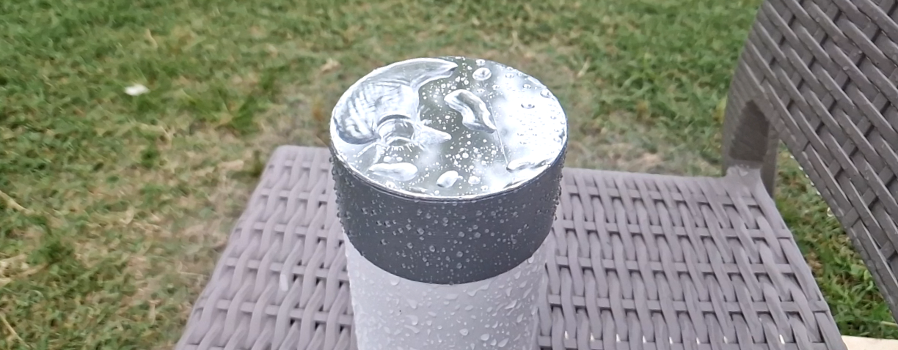

# Rain drop counter: data, code snippets, and tutorials

## YouTube tutorials
- Want to build a device? See this [how to build a basic device tutorial](https://youtu.be/yDxtZpp3iUc)
- Got a recording. What's next? See this [audio testing with Audacity tutorial](https://youtu.be/BJxE__xmKJg)
- Want to quickly annotate a recording? See this [marking acoustic events in Audacity tutorial](https://youtu.be/3fyaKuSi178)

## Folder structure
The **data** folder contains the actual data used in the paper. 
The **sandbox** folder contains code snippets to help reproduce the data used in the paper.

## Software and hardware
Most of the work was done in `Python 3.11`  on a standard CPU-laptop running a Linux OS.

The reusable code is organised in a package
```python
# reusable, rain drop counter related code
import rainml
# For example, TensorFlow model definitions are here:
import rainml.tfmodels
```

### Linux OS related
The `augment` routine (`from rainml.augment import augment`) uses system calls to the `sox` audio processing utility. 
```bash
pacman -S sox
# or
apt install sox
```
It has been tested on Linux only. My understanding is that SoX should be available for Windows and OSX.
